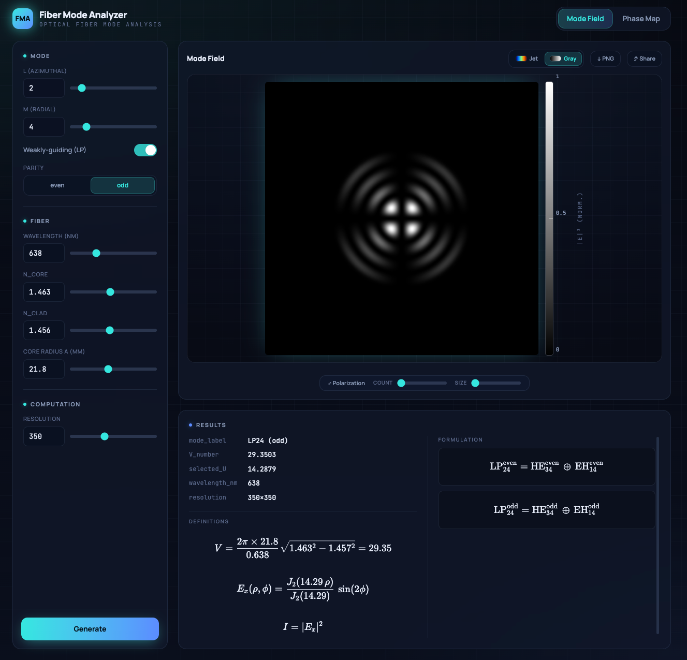
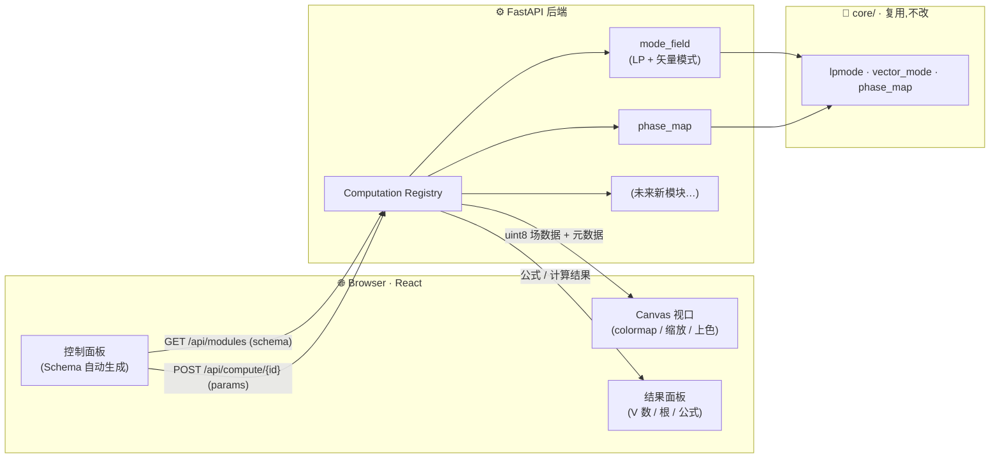

# PhotonLab · 光子仿真实验室

一个交互式的**光学/光子学仿真平台**。当前已支持**光纤本征模式分析**与**相位图设计**,并正朝衍射传播、耦合模式、散射场、偏振光学等方向扩展。后端用 Python（FastAPI + NumPy/SciPy）做科学计算,前端用 React 做流畅、可缩放的交互式可视化。



---

## ✨ 功能

- **模式场（Mode Field）**
  - 任意**梯度折射率**与**阶跃折射率**圆光纤的**矢量本征模式**分析
  - **弱导近似（LP 模式）**分析，一键在矢量模式与 LP 之间切换
  - 偏振方向 / 奇偶模式、偏振箭头叠加层
  - 实时显示 V 数、特征根、模式分解等计算结果
- **相位图（Phase Map）**
  - 任意 **LP 模式**与 **OAM（涡旋）模式**相位图生成与导出
  - 可叠加任意**闪耀光栅**（fx / fy）
  - 多种输出尺寸（1024×1024 / 1920×1080）
- **交互体验**
  - 滑块实时调参、Canvas 客户端上色（切 colormap / 缩放无需请求后端）
  - 公式（KaTeX）与定义实时渲染

---

## 🧱 架构

科学计算留在 Python 生态；前端只负责渲染与交互。两者通过 JSON HTTP API 解耦。


**数据流：** 用户调参 → 前端 `POST /api/compute/{id}` → 后端跑对应计算 → 返回归一化场数据(uint8/base64)+ 元数据 → 前端 Canvas 上色显示。切 colormap / 缩放在前端本地完成,无需再请求后端。

```
core/                      # 纯计算引擎 (NumPy/SciPy)，不依赖 Web
  lpmode.py                #   LP 模式
  vector_mode.py           #   矢量本征模式
  phase_map.py             #   相位图 / 涡旋 / 闪耀光栅

backend/                   # FastAPI 服务
  main.py                  #   API: /api/health, /api/modules, /api/compute/{id}
  computations/
    base.py                #   注册表核心: Computation / ComputeResult / ParamSpec
    mode_field.py          #   模块①: 复用 core/lpmode + core/vector_mode
    phase_map.py           #   模块②: 复用 core/phase_map

frontend/                  # React 18 + TypeScript + Tailwind v4 (Vite 6)
  src/api/                 #   后端调用 + 类型
  src/render/              #   colormaps + canvas 渲染（客户端上色）
  src/components/          #   ControlPanel(schema 驱动) / Viewport / ResultsPanel / Toolbar
```

**核心设计 — 计算注册表（Computation Registry）：** 每个计算被注册为一个“插件”，声明自己的参数 `schema`。后端的 `/api/modules` 把 schema 返回给前端，**前端控件由 schema 自动生成**——新增一个计算只需写一个 Python 模块并 `register()`，前后端 UI 自动适配。

---

## 🚀 快速开始

### 1. 安装（一次性）

```bash
# 后端：venv 复用系统的 numpy/scipy
python3 -m venv --system-site-packages .venv
.venv/bin/pip install -r backend/requirements.txt

# 前端
cd frontend && npm install && cd ..
```

### 2. 启动

```bash
./run_web.sh          # 同时启动后端(:8000) 与前端(:5173)
```

然后浏览器打开 **http://localhost:5173**。

> 也可以分开启动：
> ```bash
> .venv/bin/uvicorn backend.main:app --reload --port 8000
> cd frontend && npm run dev
> ```

---

## 📡 API

| 方法 & 路径 | 作用 |
|------|------|
| `GET /api/health` | 健康检查，返回已注册模块列表 |
| `GET /api/modules` | 所有计算模块及其参数 schema（驱动前端控件） |
| `POST /api/compute/{id}` | 按参数运行指定计算，返回场数据(uint8/base64) + 元数据 |

---

## 🗺️ 待补充功能

- [ ] 偏振态 UI 优化
- [ ] 衍射传播理论（多种衍射算法）
- [ ] 耦合模式理论
- [ ] T 矩阵理论计算散射场
- [ ] 实时相位优化算法
- [ ] 偏振片 / 波片 / SLM / 偏振控制器 / OAM 干涉 / 透镜模拟算法
- [ ] 光纤模式识别算法
- [ ] 其余光学元件模拟算法
